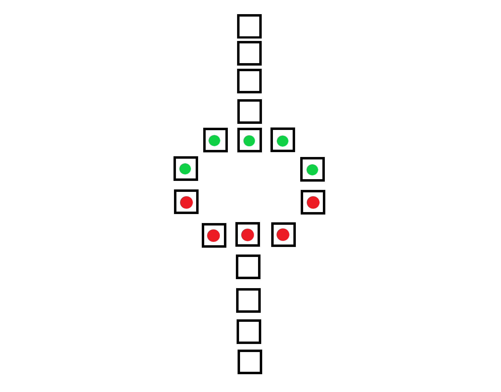

# Pente Grammai: An implementation of the end of semester project for CS 250 at Old Dominion University.

#### Documentation located in: readme.md

#### William G. Schaffer

### Background:

Pente Grammai is an ancient Greek board game, played with two opposing players and involves the
rolling of dice (values 1-6) in order to traverse the board in a counter-clockwise manner.

### Mechanics:
1. Red and green players
    1.a. 5 red pieces
    1.b. 5 green pieces

2. Initial setup is with all ten pieces in the circle in the middle of the board.

3. Each player can move one piece per turn based on a roll of a 1 - 6 sided dice.

4. If a piece lands on the sacred line, the player earns an extra turn.

5. Player is obligated to make a turn if a legal move is possible.

6. If no legal moves are available, then the player can forfeit his turn.

7. An illegal move constitutes moving to an occupied spot.

### How to Win
If a player places all of his pieces on the sacred line opposite from his starting position, then he wins.

